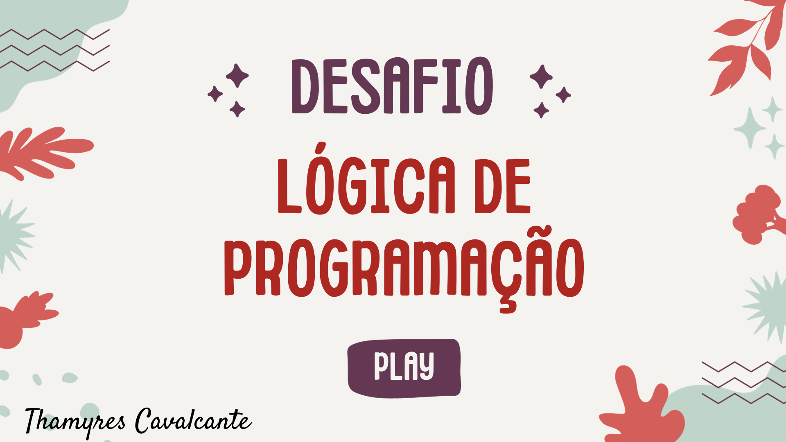

# Desafio Classificador de nível de Herói

**O Que deve ser utilizado**

- Variáveis
- Operadores
- Laços de repetição
- Estruturas de decisões

**Objetivo**

Crie uma variável para armazenar o nome e a quantidade de experiência (XP) de um herói, depois utilize uma estrutura de decisão para apresentar alguma das mensagens abaixo:
- Se XP for menor do que 1.000 = Ferro
- Se XP for entre 1.001 e 2.000 = Bronze
- Se XP for entre 2.001 e 5.000 = Prata
- Se XP for entre 6.001 e 7.000 = Ouro
- Se XP for entre 7.001 e 8.000 = Platina
- Se XP for entre 8.001 e 9.000 = Ascendente
- Se XP for entre 9.001 e 10.000= Imortal
- Se XP for maior ou igual a 10.001 = Radiante

**Saída**

Ao final deve se exibir uma mensagem:
`"O Herói de nome **{nome}** está no nível de **{nivel}**"`

## ✔️ Técnicas e tecnologias utilizadas

- ``Java``
- ``InteliJ IDEA``

## 📁 Acesso ao projeto

É possível acessar o projeto através do [Link](https://github.com/Thamyresmya/Desafio-Dio-Logica-Programacao)

Neste repositório você tem acesso a todo o material produzido no curso.

## Desenvolvedores

[ Thamyres Cavalcante](https://github.com/Thamyresmya) 

- 

## 👍 Me siga nas redes sociais

- [Linkedin](https://www.linkedin.com/in/thamyrescavalcante/)
- [Instagran](https://www.instagram.com/thamyres__cavalcante/)

 

---

### Feito com 💜 by Thamyres Cavalcante.

