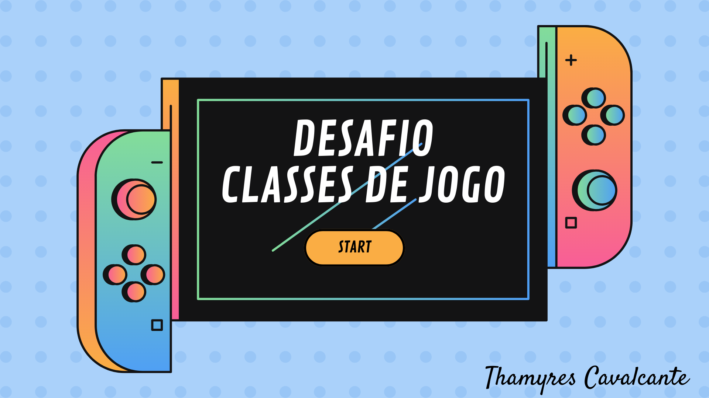

# Desafio Escrevendo as Classes de Um Jogo

Instruções para entrega

**O Que deve ser utilizado**

- Variáveis
- Operadores
- Laços de repetição
- Estruturas de decisões
- Funções
- Classes e Objetos

**Objetivo:**

Crie uma classe generica que represente um herói de uma aventura e que possua as seguintes propriedades:

- nome
- idade
- tipo (ex: Guerreiro, Mago, Monge, Ninja)

além disso, deve ter um método chamado atacar que deve atender os seguientes requisitos:

- exibir a mensagem: "o {tipo} atacou usando {ataque}"
- aonde o {tipo} deve ser concatenando o tipo que está na propriedade da classe
- e no {ataque} deve seguir uma descrição diferente conforme o tipo, seguindo a tabela abaixo:

se mago -> no ataque exibir (usou magia)
se guerreiro -> no ataque exibir (usou espada)
se monge -> no ataque exibir (usou artes marciais)
se ninja -> no ataque exibir (usou shuriken)

**Saída**

Ao final deve se exibir uma mensagem:

- "o {tipo} atacou usando {ataque}"
  ex: mago atacou usando magia
  guerreiro atacou usando espada

## ✔️ Técnicas e tecnologias utilizadas

- ``Java``
- ``InteliJ IDEA``

## 📁 Acesso ao projeto

É possível acessar o projeto através do [Link](https://github.com/Thamyresmya/Desafio-Dio-Logica-Programacao-Jogo)

Neste repositório você tem acesso a todo o material produzido no curso.

## Desenvolvedores

[ Thamyres Cavalcante](https://github.com/Thamyresmya) 

- 

## 👍 Me siga nas redes sociais

- [Linkedin](https://www.linkedin.com/in/thamyrescavalcante/)
- [Instagran](https://www.instagram.com/thamyres__cavalcante/)

 

---

### Feito com 💜 by Thamyres Cavalcante.

